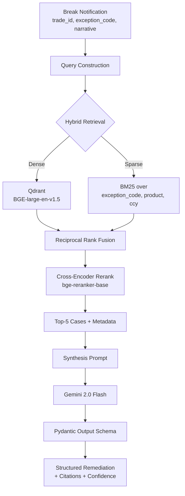

# Settlement Break Investigation Agent

[](https://github.com/SathyaPrakashD/settlement-break-agent/actions/workflows/ci.yml)

> Production-grade retrieval system for financial settlement break investigation. RAG-first foundation that grows into a LangGraph + MCP agent.

**Status:** v0.1 — RAG foundation. Active development.
**Author:** Sathya Prakash D ([LinkedIn](https://linkedin.com/in/sathyaprakashd))
**Stack:** Python 3.11 · uv · Qdrant · BGE embeddings · Gemini 2.0 Flash · Pydantic · Typer

---

## The problem

Every large investment bank handles hundreds to thousands of **failed trade settlements** ("breaks") daily — a break is when a trade doesn't settle on its intended date because of mismatched details, wrong/missing Standard Settlement Instructions (SSIs), counterparty issues, or operational delays. Settlement Operations teams investigate each break manually, identify root cause, and remediate.

The work pattern is consistent: an analyst reads a break exception narrative, pulls trade and counterparty context from multiple systems, recognises the case as similar to past breaks they've seen, and applies the resolution that worked before. **This is exactly the work pattern that a retrieval-augmented system can amplify** — not replace the analyst, but give them the right historical context and a drafted remediation in seconds rather than minutes.

The shift from T+2 to T+1 settlement in the US (May 2024) and earlier in India compressed the investigation window from days to hours. **Faster investigation is now a regulatory and operational necessity, not a productivity nice-to-have.**

## What this is

A system that:

1. Accepts a structured break notification (trade ID, exception code, narrative)
2. Retrieves the **most similar past breaks** from a historical corpus, using hybrid search (dense embeddings + BM25 sparse retrieval, fused via Reciprocal Rank Fusion, then reranked by a cross-encoder)
3. Synthesises a **drafted remediation** citing the historical cases, with confidence scoring and structured output
4. Exposes the whole pipeline through a CLI (v0.1), MCP server (v0.2), and LangGraph agent with human-in-the-loop (v0.3)

**Data is synthetic.** Generated by a Faker-based generator producing realistic distributions across 6 break categories. No real institutional data is used or referenced. *Anyone running this repo gets a working demo with `docker compose up`.*

## What this is NOT

- It is not a ChatGPT wrapper. State is checkpointed, retrieval is hybrid, output is schema-enforced, eval is gated.
- It is not a replacement for a settlement operations analyst. Every remediation requires human approval before any action.
- It is not generic "production RAG." It earns the "production" claim through eval methodology, cost analysis, observability, and security posture — not by name.

---

## Architecture (v0.1)



## Opinionated framework choices

I made these calls deliberately. The rejected alternatives are noted because *production architecture is about the choice, not the default.*

| Layer | Chosen | Rejected | Why |
|---|---|---|---|
| **Vector DB** | Qdrant (self-hosted Docker) | Pinecone, Weaviate, ChromaDB, pgvector | Qdrant has best-in-class hybrid search built in, runs on a laptop for dev, scales to managed cloud for prod. ChromaDB is too thin for hybrid; pgvector is great for banks but adds Postgres ops complexity I don't need at v0.1. ADR-001. |
| **Embedding model** | `bge-large-en-v1.5` (BAAI) | OpenAI `text-embedding-3-large`, Voyage `voyage-3` | Open-source, top of MTEB retrieval leaderboard, runs locally, no API spend during indexing. Cost matters when re-indexing a 500-doc corpus 50 times during development. ADR-002. |
| **Sparse retrieval** | BM25 via `rank_bm25` | Splade, OpenSearch | BM25 is the right tool for structured field matching (exception codes, ISO currency codes, counterparty IDs). Splade is overkill at v0.1; OpenSearch is operational overhead I don't need yet. |
| **Fusion** | Reciprocal Rank Fusion (k=60) | Weighted score sum, learned fusion | RRF is rank-based, parameter-light, and well-studied. Score fusion across heterogeneous scorers is a calibration trap. ADR-003. |
| **Reranker** | `bge-reranker-base` | Cohere Rerank API, ColBERT | Local, free, latency-acceptable for the rerank-20-down-to-5 use case. Cohere Rerank is better but costs $1/1K queries and I want zero recurring cost at v0.1. |
| **Synthesis LLM** | Gemini 2.0 Flash | GPT-4o, Claude Sonnet, local Llama | Cheapest credible model for structured-output synthesis at v0.1. ~$0.075/M input tokens vs $2.50 for GPT-4o. Easily swappable via `config.py`. |
| **Output structure** | Pydantic + Gemini structured output | JSON-mode prompt, Instructor library | Schema enforcement at the API layer is the strongest guarantee. Pydantic is the standard. |
| **CLI framework** | Typer | argparse, Click | Typer wraps Click with Pydantic-style type inference. Modern default. |
| **Package mgmt** | uv | pip + venv, Poetry | uv is 10-100x faster, written in Rust, and is becoming the 2026 default. Worth the early adoption. |

## Evaluation methodology

**Eval-driven development from day one.** Every change runs through three eval layers before merge:

### Layer 1 — Deterministic checks (free, fast, run on every commit)

- Output schema validates against the Pydantic spec
- All `cited_case_ids` exist in the corpus
- No hallucinated trade IDs (regex check against valid format)
- Latency budget: P95 < 5s end-to-end on the dev laptop

### Layer 2 — Retrieval metrics (against the golden set)

The golden set is 30 hand-labelled breaks where I (or in production, an analyst) recorded which historical case ID was actually the right reference.

- **Precision@5** — is the correct case in the top-5 retrieved?
- **MRR (Mean Reciprocal Rank)** — how high does the correct case rank on average?
- **Hit Rate @1** — does the top-1 retrieved case match the labelled answer?

### Layer 3 — Synthesis quality (LLM-as-judge, pairwise)

For each golden case, the system's drafted remediation is compared **pairwise** against a human-written reference remediation. Judge model (Gemini 2.5 Pro — *different family from the synthesiser to reduce self-preference bias*) is asked: "Which remediation better addresses the break — A, B, or tied?" with position randomisation to control for position bias.

Reported as: **% wins / % ties / % losses** vs the human reference.

### What I have not yet built (Layer 4)

Cost-per-investigation tracking, distributed tracing via OpenTelemetry, human spot-check sampling against production traffic. These arrive in v0.4+.

---

## Quickstart

```bash
# Prerequisites: Python 3.11+, Docker, uv installed (https://github.com/astral-sh/uv)

# Clone and enter
git clone https://github.com/SathyaPrakashD/settlement-break-agent.git
cd settlement-break-agent

# Spin up Qdrant
docker compose up -d

# Install deps
uv sync

# Copy env template and add your Gemini API key
cp .env.example .env
# Edit .env to add GEMINI_API_KEY

# Generate synthetic corpus (500 breaks)
uv run sba generate-corpus --count 500

# Index the corpus
uv run sba index

# Investigate a break
uv run sba investigate --trade-id TRD-000123

# Run the eval suite
uv run sba eval
```

## Production checklist

A checklist of items required for this to be deployable in a regulated environment. Honestly marked.

- [x] Synthetic data only — no PII or institutional data
- [x] Reproducible local environment via Docker Compose
- [x] Deterministic eval layer in repo
- [x] Pydantic-enforced structured output
- [x] Architecture decisions documented (ADRs)
- [ ] Authentication / authorisation (v0.4)
- [ ] Per-user / per-tenant isolation (v0.4)
- [ ] OpenTelemetry distributed tracing (v0.4)
- [ ] Cost tracking + budget alerts (v0.4)
- [ ] Output PII / sensitive-field redaction (v0.4)
- [ ] Prompt injection defence + tool allowlisting (v0.4)
- [ ] CI eval gates on PR merge (v0.4)
- [ ] Human-approved trail for any side-effecting action (v0.3 via LangGraph HITL)
- [ ] Disaster recovery + index rebuild procedure (v0.5)
- [ ] SOC2-aligned audit logging (v0.5)
- [ ] Model cards for all components (v0.5)

---

## Roadmap

| Version | Goal | Status |
|---|---|---|
| **v0.1** | RAG-first foundation with hybrid retrieval, structured synthesis, eval harness | In progress |
| **v0.2** | MCP server + structured data tools (trade detail, counterparty SSI, settlement status) | Planned |
| **v0.3** | LangGraph state machine with HITL gate, checkpointing, trajectory eval | Planned |
| **v0.4** | Production hardening: Langfuse tracing, cost dashboard, NeMo Guardrails, OTEL | Planned |
| **v0.5** | Public demo on HF Spaces, Loom walkthrough, governance overlay | Planned |

## Background

I architected and presented an [AI Support Co-Pilot for Citi](https://linkedin.com/in/sathyaprakashd) in 2025 — a production support assistant for tier-one BFSI delivery. This project is the **open-source, anonymised extension of that pattern** into a different operational domain: settlement operations. Same architectural shape, different data, different stakes.

The full 12-month architect pivot plan, including this project's position in the trajectory, is documented separately.

## License

MIT. *Use, fork, learn from this. Attribution appreciated, not required.*

## Acknowledgements

- Eugene Yan's [Patterns for Building LLM-based Systems](https://eugeneyan.com/writing/llm-patterns/) is the conceptual backbone.
- Chip Huyen's *AI Engineering* (O'Reilly, 2024) for the framework selection methodology.
- Lilian Weng's [LLM Powered Autonomous Agents](https://lilianweng.github.io/posts/2023-06-23-agent/) for v0.3's state machine design.
- The Anthropic team for the Model Context Protocol that v0.2 builds on.
