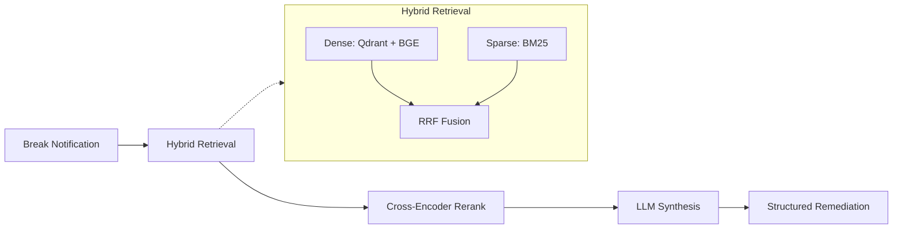
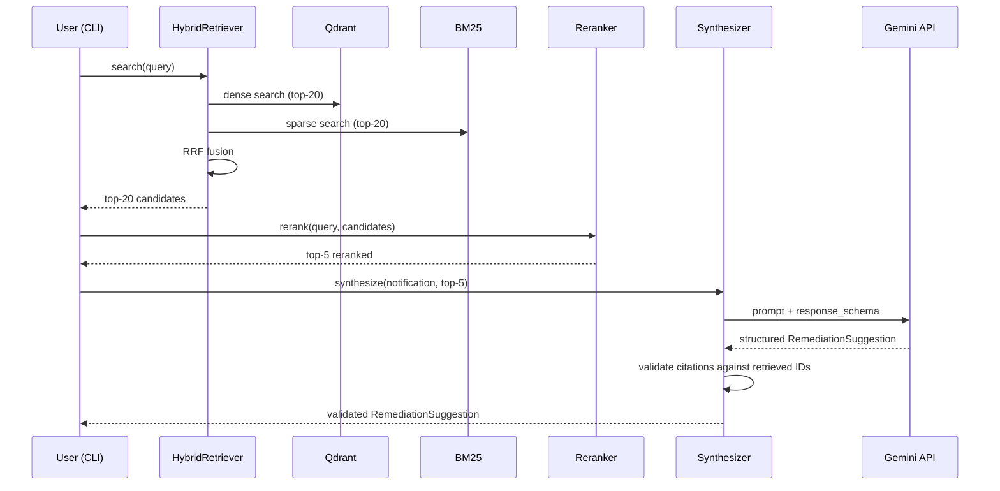
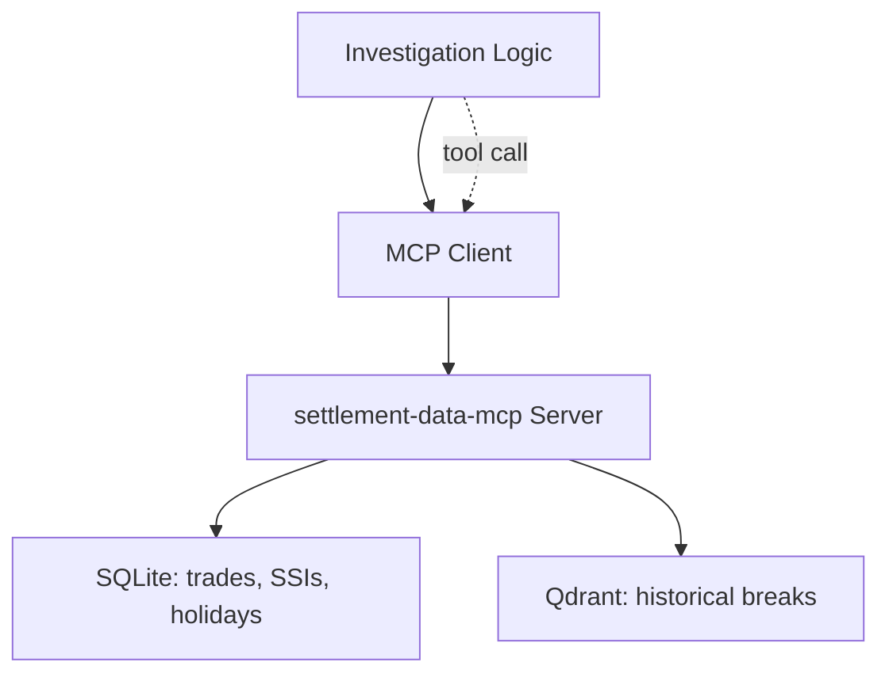
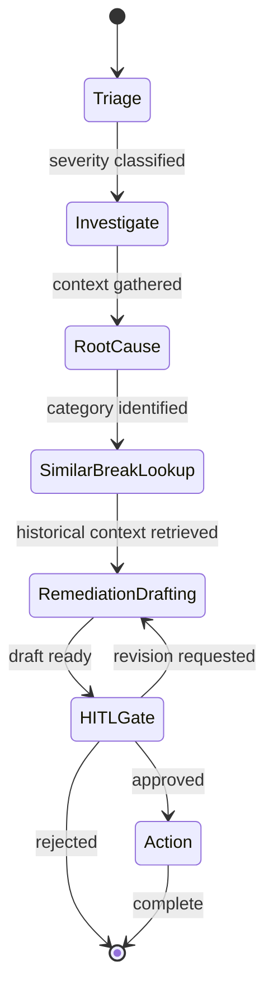

# Architecture

## v0.1 — RAG-first foundation

The system is a four-stage pipeline that takes a structured break notification and produces a structured remediation suggestion.

### High-level flow

### Component responsibilities

| Component | Module | Job |
|---|---|---|
| Synthetic generator | `sba.synthetic.generator` | Produce realistic historical breaks for indexing and eval |
| Indexer | `sba.retrieval.indexer` | Embed corpus, write to Qdrant, build BM25 index |
| Dense retriever | `sba.retrieval.dense` | Cosine-sim retrieval over BGE embeddings via Qdrant |
| Sparse retriever | `sba.retrieval.sparse` | BM25 retrieval over tokenised structured + free-text fields |
| Hybrid retriever | `sba.retrieval.hybrid` | Combine dense + sparse via Reciprocal Rank Fusion |
| Reranker | `sba.retrieval.rerank` | Cross-encoder rerank to top-K |
| Synthesiser | `sba.synthesis.synthesizer` | Gemini structured-output call to draft remediation |
| Eval suite | `evals/` | Three-layer eval: deterministic, retrieval, synthesis |
| CLI | `sba.cli` | End-to-end entry points |

### Data flow

## v0.2 (planned) — MCP server layer

The retrieval logic from v0.1 stays unchanged — it just gets exposed as an MCP tool (`search_historical_breaks`) alongside structured data tools (`get_trade_detail`, `get_counterparty_ssi`, etc.).

## v0.3 (planned) — LangGraph agent

